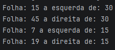

---

# Arvore-Binaria

projeto antigo reorganizado

---

# Árvore Binária Refatorada

Este é um projeto de **árvore binária em Java**, desenvolvido há algum tempo, que foi **refeito, refatorado e reorganizado** para uma estrutura mais limpa, e de fácil entendimento.

O objetivo do projeto é demonstrar a implementação de uma **estrutura de dados clássica**, aplicando conceitos fundamentais como:

* Programação orientada a objetos
* Organização de pacotes
* Boas práticas de estruturação de código

---

## Estrutura do Projeto

```
Arvore-Binaria/
│
├── src/com.gabrielwederson.arvorebinaria
│   ├── Arvore.java        # Implementação da árvore binária
│   ├── Folha.java              # Representação do nó da árvore      
├── teste
│    ├── Main.java         #Zona de teste
└── README.md
```

---

## Funcionalidades

* Inserção de elementos na árvore
* Busca de valores

* Estrutura organizada separando:

    * Representação do nó
    * Construção da árvore
    * Execução principal

---

## Como Rodar

1. Abra o projeto em qualquer IDE Java.
2. Certifique-se de ter um **JDK configurado** (Java 17 ou superior).
3. Compile e execute `Main.java`.
4. Observe a execução dos métodos da árvore no console.

---

## Observações

Este projeto é uma versão **refatorada de um código antigo**, que foi reorganizado com foco em:

* Melhor separação de responsabilidades
* Código mais limpo e legível
* Estrutura mais próxima de um projeto profissional

A refatoração teve como objetivo aplicar boas práticas e melhorar a organização geral da implementação da árvore binária.

---

## Demonstração

Segue um print do terminal com a árvore sendo executada:


